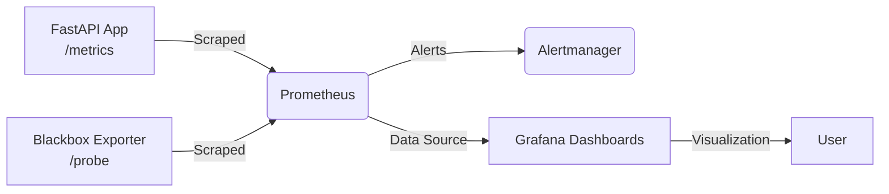
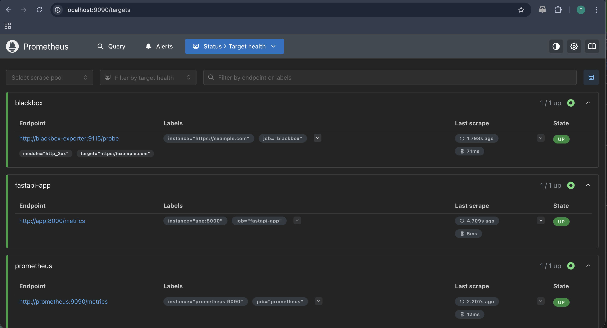
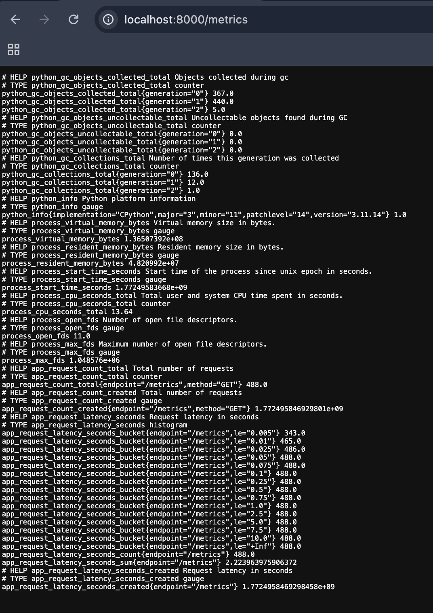
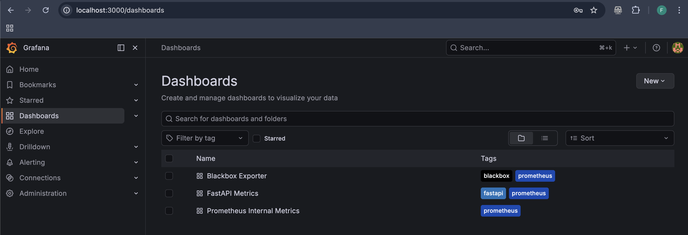
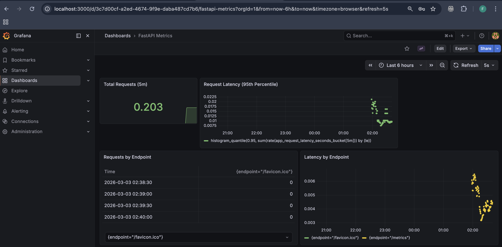
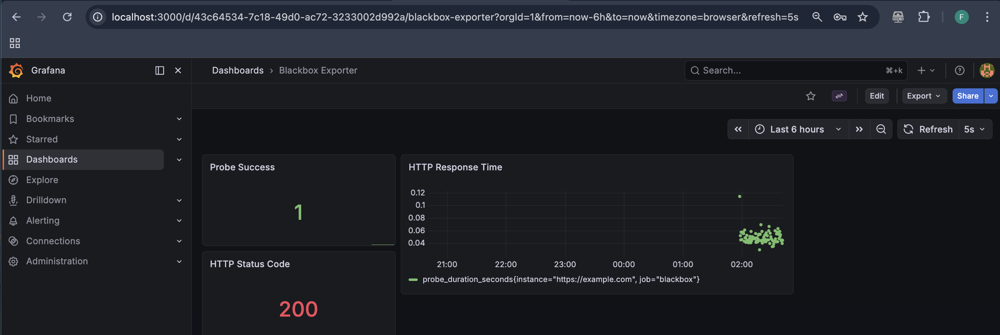
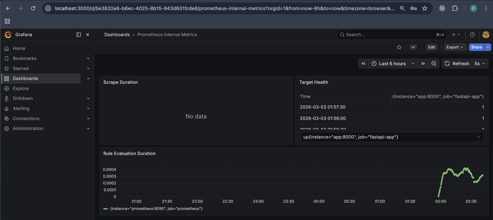
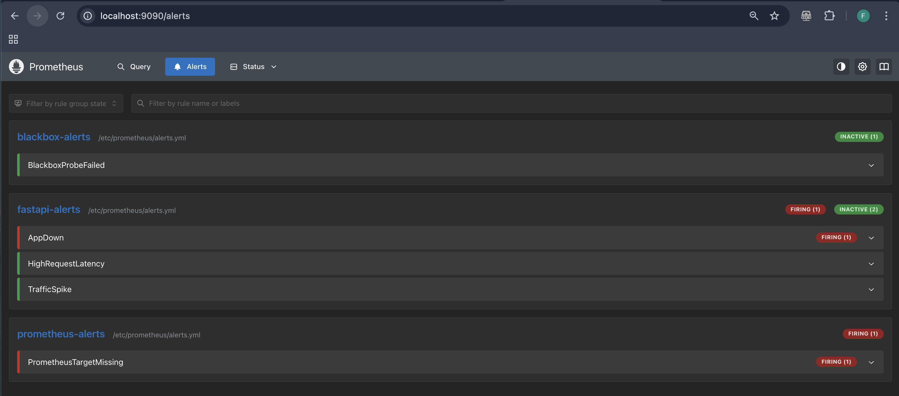
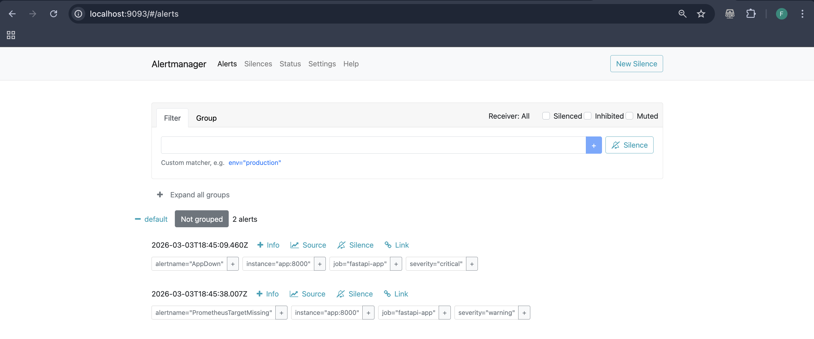
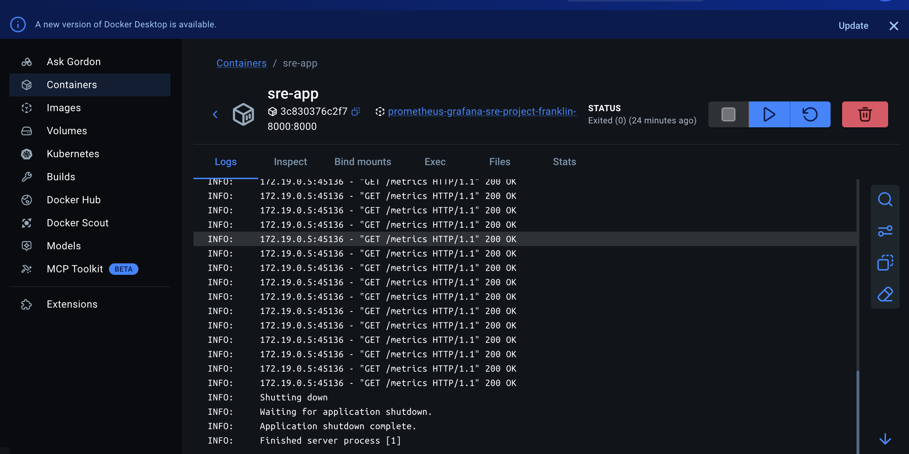

<p align="center">
  
  
  
  
  
  
</p>

# 📡 SRE Observability Platform — FastAPI • Prometheus • Grafana • Alertmanager • Blackbox Exporter

A complete, production-grade observability and alerting platform built around a FastAPI application, instrumented with Prometheus metrics, visualized through Grafana dashboards, monitored externally via Blackbox Exporter, and equipped with a full alerting pipeline using Prometheus Alerting Rules + Alertmanager.

This project demonstrates real-world SRE/DevOps practices:

- Application instrumentation  
- Exporter integration  
- Alerting pipelines  
- Dashboard provisioning  
- Environment-aware configuration  
- Clean, production-ready documentation  

---

# 🏗️ Architecture Overview



## Components

- **FastAPI** — Exposes custom Prometheus metrics (request count, latency)
- **Prometheus** — Scrapes metrics, evaluates alert rules, stores time-series data
- **Alertmanager** — Receives alerts and manages routing, grouping, silencing
- **Grafana** — Visualizes metrics using auto-provisioned dashboards
- **Blackbox Exporter** — Probes external endpoints (HTTP/HTTPS)
- **Docker Compose** — Orchestrates the entire stack

> **Note:** `node-exporter` and `cAdvisor` are disabled on macOS because they require Linux kernel features. They remain included for Linux deployment.

---

# ✨ Features

- Application-level metrics (FastAPI)
- External uptime monitoring (Blackbox Exporter)
- Auto-provisioned Grafana dashboards
- Prometheus internal health monitoring
- Full alerting pipeline (Prometheus → Alertmanager)
- Critical, warning, and probe-based alerts
- Clean, modular Docker Compose setup
- Environment-aware configuration (macOS vs Linux)
- Production-ready folder structure

---

# 📂 Project Structure

```
prometheus-grafana-sre-project/
│
├── app/
│   └── src/
│       └── main.py
│
├── monitoring/
│   ├── prometheus/
│   │   ├── prometheus.yml
│   │   └── alerts.yml
│   │
│   ├── alertmanager/
│   │   └── alertmanager.yml
│   │
│   └── grafana/
│       ├── dashboards/
│       │   ├── fastapi-dashboard.json
│       │   ├── blackbox-dashboard.json
│       │   └── prometheus-internal-dashboard.json
│       └── provisioning/
│           ├── dashboards/
│           │   └── dashboard.yml
│           └── datasources/
│               └── datasource.yml
│
├── docker-compose.yml
└── README.md
```

---

# 🚀 Running the Stack

## 1️⃣ Start all services

```bash
docker compose up --build
```

> If you are using the legacy CLI:
>
> ```bash
> docker-compose up --build
> ```

---

## 2️⃣ Access the Components

| Service | URL |
|----------|------|
| FastAPI | http://localhost:8000 |
| FastAPI Metrics | http://localhost:8000/metrics |
| Prometheus | http://localhost:9090 |
| Prometheus Targets | http://localhost:9090/targets |
| Prometheus Alerts | http://localhost:9090/alerts |
| Grafana | http://localhost:3000 |
| Alertmanager | http://localhost:9093 |
| Blackbox Exporter | http://localhost:9115 |

---

## 3️⃣ Grafana Login

- **Username:** `admin`  
- **Password:** `admin`  

You will be prompted to set a new password on first login.

---

# 📊 Metrics Exposed by FastAPI

## Custom Metrics

- `app_request_count_total` — Total requests by method and endpoint  
- `app_request_latency_seconds` — Request latency histogram  

## Built-in Metrics

- Python GC metrics  
- Process CPU and memory usage  
- Uvicorn worker metrics  

---

# 🚨 Alerting System (Prometheus + Alertmanager)

This project includes a full alerting pipeline:

1. Prometheus evaluates alert rules every 5 seconds  
2. Alerts fire when conditions are met  
3. Alertmanager receives, groups, and displays alerts  
4. Alerts resolve automatically when conditions return to normal  

---

## 📄 Alert Rules (`alerts.yml`)

| Alert | Severity | Description |
|--------|----------|------------|
| AppDown | critical | FastAPI container is down |
| HighRequestLatency | warning | 95th percentile latency > 0.5s |
| TrafficSpike | warning | Unusual request rate spike |
| BlackboxProbeFailed | critical | External endpoint unreachable |
| PrometheusTargetMissing | warning | Any scrape target is down |

---

## 📄 Alertmanager Configuration (`alertmanager.yml`)

```yaml
global:
  resolve_timeout: 5m

route:
  receiver: "default"

receivers:
  - name: "default"
    webhook_configs:
      - url: "http://localhost:5001"
```

---

# 🧪 Testing Alerts

## 1️⃣ Trigger `AppDown` alert

```bash
docker stop sre-app
```

## 2️⃣ Wait 30 seconds

The Prometheus rule uses:

```yaml
for: 30s
```

## 3️⃣ Check Prometheus Alerts

http://localhost:9090/alerts

You should see:

- `AppDown` — **FIRING**
- `PrometheusTargetMissing` — **FIRING**

---

## 4️⃣ Check Alertmanager

http://localhost:9093

You should see:

- Active alert group  
- `AppDown` (critical)  
- `PrometheusTargetMissing` (warning)  

---

## 5️⃣ Restore the App

```bash
docker start sre-app
```

Alerts will resolve automatically once the service is healthy again.

---

# 🖼️ Screenshots

1. **Prometheus Targets (All UP)**  
   

2. **FastAPI `/metrics` Endpoint**  
   

3. **Grafana Dashboard List**  
   

4. **FastAPI Metrics Dashboard**  
   

5. **Blackbox Exporter Dashboard**  
   

6. **Prometheus Internal Dashboard**  
   

7. **Prometheus Alerts Page (with firing alerts)**  
   

8. **Alertmanager UI (with active alerts)**  
   

9. **Docker Desktop — `sre-app` Exited**  
   

---

# 🌍 macOS vs Linux Notes

macOS cannot run:

- `node-exporter`  
- `cAdvisor`  

Because they require:

- `/proc`  
- `/sys`  
- cgroups  
- Privileged mounts  

These exporters are included but disabled locally. They will work automatically when deployed on Linux.

---

# 🔮 Future Enhancements

- Slack / Email / Discord alert notifications  
- Loki + Promtail for log aggregation  
- node-exporter and cAdvisor enabled on Linux  
- Makefile for developer ergonomics  
- Kubernetes deployment (Helm or Kustomize)  
- Alert grouping and inhibition rules  

---

# 🏁 Conclusion

This project demonstrates a complete observability and alerting pipeline:

- Application instrumentation  
- Metrics scraping  
- Dashboard visualization  
- External probing  
- Alert rule evaluation  
- Alert routing and management
  
