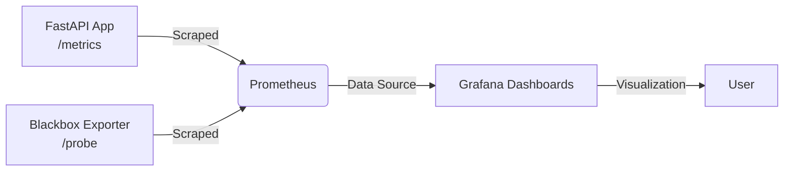

# 📡 SRE Observability Platform — FastAPI • Prometheus • Grafana • Blackbox Exporter
A complete, production‑grade observability stack built around a FastAPI application, instrumented with Prometheus metrics, visualized through Grafana dashboards, and extended with external uptime monitoring via Blackbox Exporter. This project demonstrates real‑world SRE/DevOps practices: application instrumentation, exporter integration, dashboard provisioning, environment‑aware configuration, and clean documentation.

## 🏗️ Architecture Overview

**Components:**
- **FastAPI** — exposes custom Prometheus metrics (request count, latency)
- **Prometheus** — scrapes metrics and stores time‑series data
- **Grafana** — visualizes metrics using auto‑provisioned dashboards
- **Blackbox Exporter** — probes external endpoints (HTTP, HTTPS)
- **Docker Compose** — orchestrates the entire stack  
> Note: `node-exporter` and `cAdvisor` are disabled on macOS because they require Linux kernel features. They remain included for Linux deployment.

## ✨ Features
- Application‑level metrics (FastAPI)
- External uptime monitoring (Blackbox Exporter)
- Auto‑provisioned Grafana dashboards
- Prometheus internal health monitoring
- Clean, modular Docker Compose setup
- Environment‑aware configuration (macOS vs Linux)
- Production‑ready folder structure

## 📂 Project Structure
```
prometheus-grafana-sre-project/
│
├── app/
│   └── src/main.py
│
├── monitoring/
│   ├── prometheus/
│   │   ├── prometheus.yml
│   │   └── alerts.yml
│   │
│   └── grafana/
│       ├── dashboards/
│       │   ├── fastapi-dashboard.json
│       │   ├── blackbox-dashboard.json
│       │   └── prometheus-internal-dashboard.json
│       └── provisioning/
│           └── dashboards.yml
│
├── docker-compose.yml
└── README.md
```

## 🚀 Running the Stack
### 1. Start all services
```bash
docker-compose up --build
```
### 2. Access the components
| Service | URL |
|--------|-----|
| FastAPI | http://localhost:8000 |
| FastAPI Metrics | http://localhost:8000/metrics |
| Prometheus | http://localhost:9090 |
| Prometheus Targets | http://localhost:9090/targets |
| Grafana | http://localhost:3000 |
| Blackbox Exporter | http://localhost:9115 |
### 3. Grafana Login
- **Username:** admin  
- **Password:** admin  
- Set a new password when prompted.

## 🖼️ Screenshots
### 1. Prometheus Targets (All UP)
Shows healthy scraping of:
- fastapi-app  
- prometheus  
- blackbox  
📸 *Insert screenshot here*

### 2. FastAPI `/metrics` Endpoint
Shows:
- `app_request_count_total`
- `app_request_latency_seconds`
- Python process metrics  
📸 *Insert screenshot here*

### 3. Grafana Dashboard List
Auto‑provisioned dashboards:
- FastAPI Metrics  
- Blackbox Exporter  
- Prometheus Internal Metrics  
📸 *Insert screenshot here*

### 4. FastAPI Metrics Dashboard
Visualizes:
- Total requests  
- Latency percentiles  
- Endpoint performance  
📸 *Insert screenshot here*

### 5. Blackbox Exporter Dashboard
Visualizes:
- Probe success  
- HTTP status  
- Response time  
📸 *Insert screenshot here*

### 6. Prometheus Internal Dashboard
Visualizes:
- Scrape duration  
- Target health  
- Rule evaluation  
📸 *Insert screenshot here*

## 📊 Metrics Exposed by FastAPI
### Custom Metrics
- **`app_request_count_total`** — total requests by method and endpoint  
- **`app_request_latency_seconds`** — latency histogram  
### Built‑in Metrics
- Python GC metrics  
- Process CPU/memory  
- Uvicorn worker metrics  

## 🌍 macOS vs Linux Notes
macOS cannot run:
- `node-exporter`
- `cAdvisor`
because they require:
- `/proc`
- `/sys`
- cgroups
- privileged mounts  
These exporters are included but disabled locally. They work automatically when deployed on Linux.

## 🔮 Future Enhancements
- Add Alertmanager for notifications  
- Add Loki + Promtail for log aggregation  
- Add node-exporter and cAdvisor on Linux  
- Add Makefile for developer ergonomics  
- Deploy to Kubernetes (Helm chart or Kustomize)  

## 🏁 Conclusion
This project demonstrates a complete observability pipeline:
- Instrumentation  
- Scraping  
- Visualization  
- External probing  
- Clean documentation  
It is designed to be both **developer-friendly** and **production-ready**, making it an excellent portfolio project for SRE/DevOps roles.
